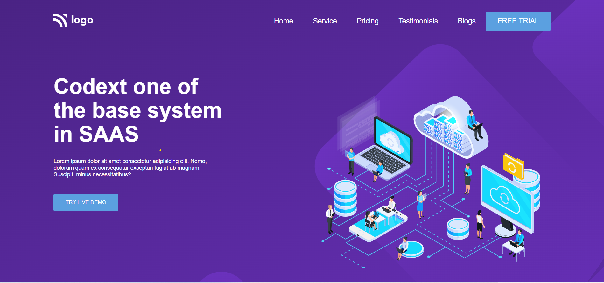
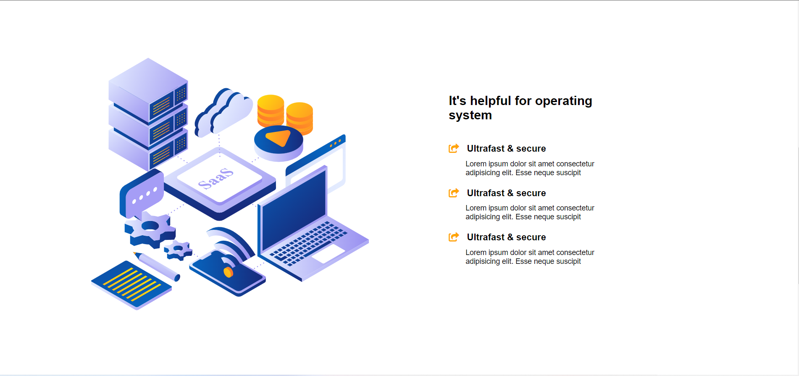
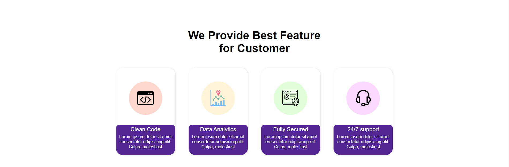

# SASS Landing Page 

 

 

> Below is the Template Which is to made to be converted into website Using Pure **HTML** and **CSS**.

 

> ## Output 

##   

 ## 🚀 Project 1 Live Link 
 
- This Project is been Hosted on Netlify. [Project Live Link](https://sass-landing-ui.netlify.app/)

## 🛠 Skills Gained in this project

  This was the Landing page Template Design Given to convert it into ``HTML`` and ``CSS``.
 - Learnd to use css position  **[Relative & Absolute]** property.
- Learned to use pseudo classes like :nth-child(), :not(), :last-child, first-child
- Learned How Media Queries Work

 ## ⌛ Time taken to finish this project 

 - Complete 3 hrs for design and 30 min for responsive

### Future Scope

- Adding Mob navbar worling function
